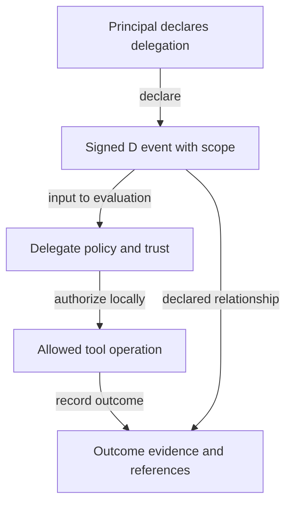

# Declared delegation and enforcement

A D statement records a delegation claim. Identity binding, actual permissions and external outcomes require independent evidence. JAC may describe declared dependencies; neither a declaration nor its graph proves real causality or valid authority.
