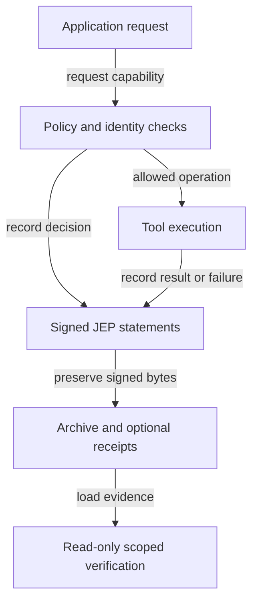

# Execution and recording

The application enforces policy independently. Recording a signed statement does not grant execution permission or guarantee atomic capture of external side effects. Replay does not invoke the tool.
