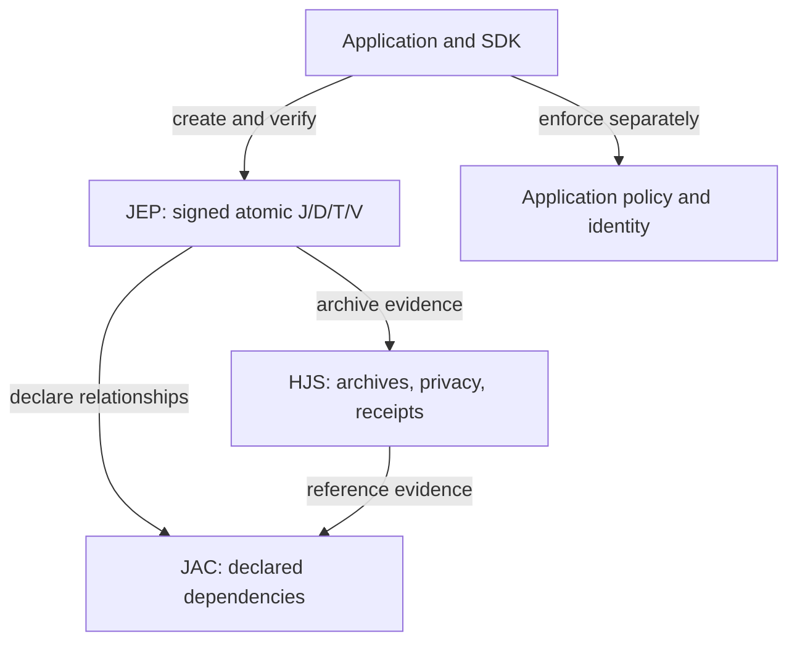

# Protocol responsibilities

JEP means Judgment Event Protocol. HJS and JAC add distinct contracts; they do not replace Core canonicalization or automatically authorize tool execution. These arrows show possible integration relationships, not a mandatory processing sequence.
