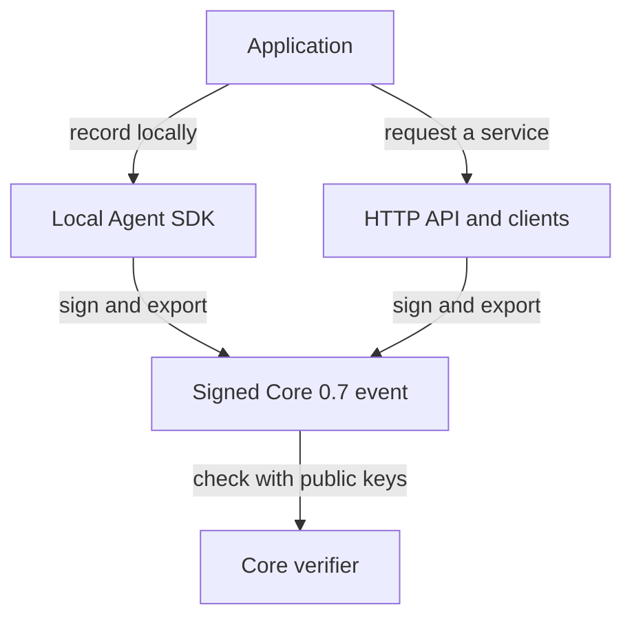

# Recording and verification

Choose local recording when the application owns its key, or HTTP when a service
owns signing and acceptance state. Both paths export signed events that can be
checked with the Core verifier. Applications configure key trust and authorization.
