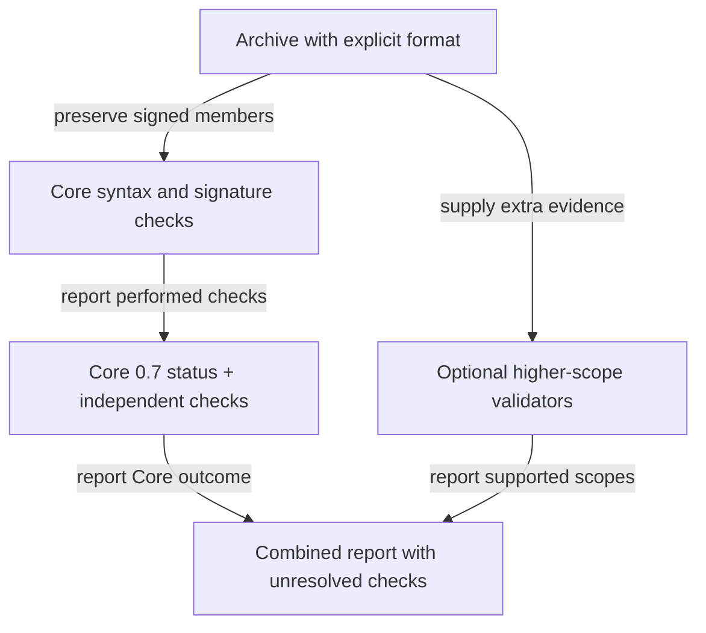

# Scoped verification result

Core canonicalization and signature verification follow JEP rules. The current reference API reports only checks it actually performs. Additional profile, chain or policy checks require corresponding evidence and validators. Preserve the original signed payload during verification.
