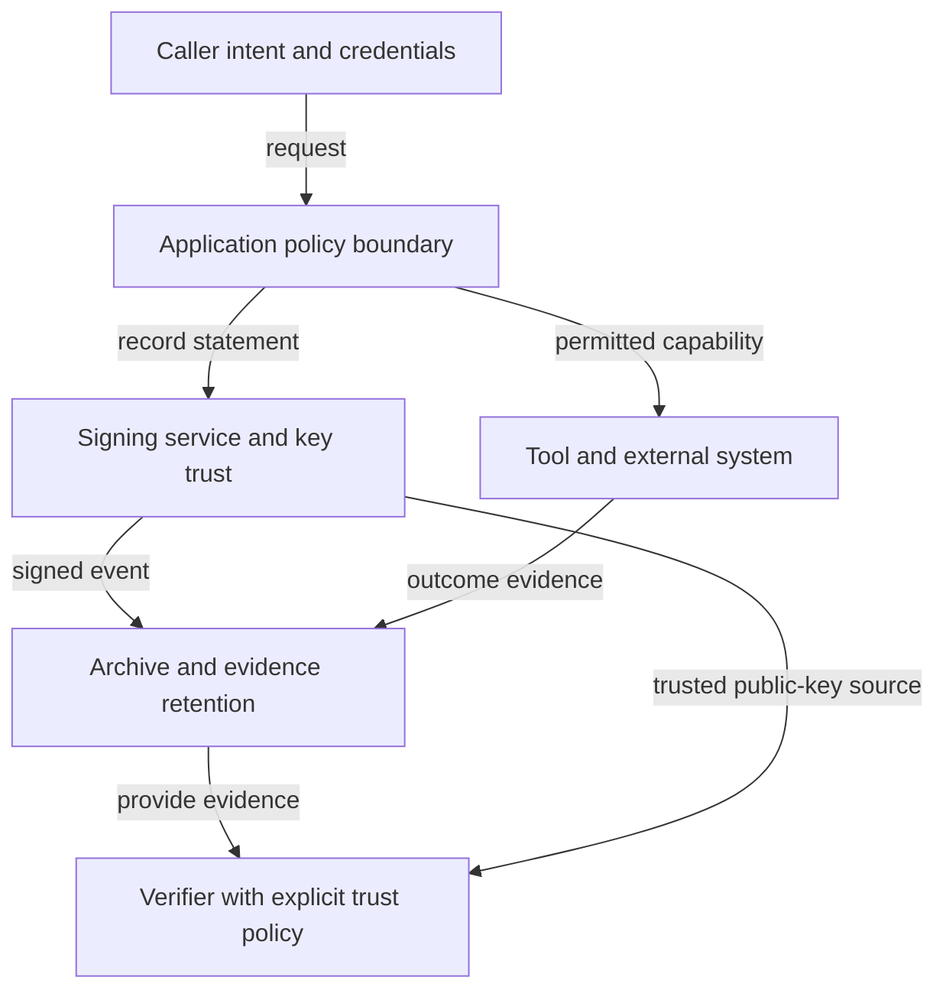

# Trust responsibilities

Caller identity, authorization, signing, external execution, storage and verification have distinct trust assumptions. Public-key availability is not sufficient trust by itself: the verifier needs a configured trusted source or key. API Level 1 does not bind who to the signer or approve the underlying action.
